<picture>
  <source media="(prefers-color-scheme: dark)" srcset="docs/logo-dark.svg">
  
</picture>

<!-- Commits-since badge points at a fixed tag (shields has no releases-based "latest" to track
     since this repo only publishes git tags, not GitHub Releases) — bump it alongside CHANGELOG.md
     and package.json on every version release. -->
[](https://github.com/DaveRutten/LoxSuite/tags)
[](https://github.com/DaveRutten/LoxSuite/commits/main)
[](https://github.com/DaveRutten/LoxSuite/issues)
[](LICENSE)

A self-hosted Docker stack for Loxone Miniservers: an MQTT gateway, log viewing, value monitoring,
scheduled backups, and a web UI to manage all of it.

It provides:

- An MQTT broker (Mosquitto), with user/role management built into the web UI.
- A bidirectional bridge between MQTT and one or more Loxone Miniservers:
  - **MQTT &rarr; Loxone**: incoming MQTT messages call a Virtual Input on a Miniserver, over HTTP or UDP.
  - **Loxone &rarr; MQTT**: a Virtual Output on a Miniserver calls back into the gateway (HTTP or UDP), which
    publishes the value to MQTT.
- **Monitor**: track any MQTT topic or Loxone value over time, with charts, tables, and CSV export.
- **Logs**: live + persisted view of the Mosquitto broker log and each Miniserver's own log.
- A web interface (with login) to manage all of the above — no manual JSON or config-file editing.

## Screenshots

<table>
<tr>
<td width="50%">

**Dashboards** — chart, value, gauge and table panels, freely arranged and resized.

<picture>
  <source media="(prefers-color-scheme: dark)" srcset="docs/screenshots/dashboard-dark.png">
  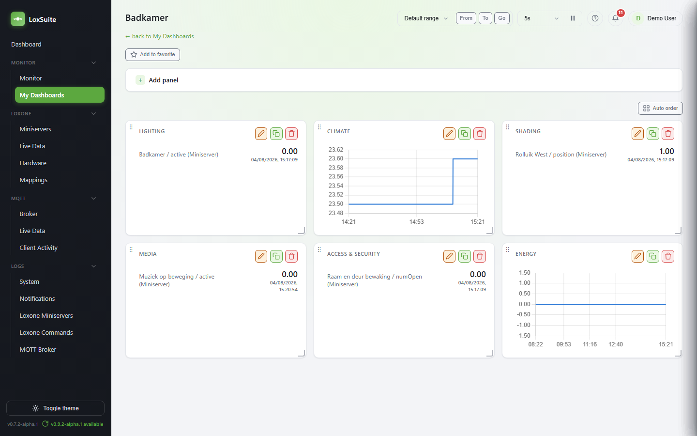
</picture>

</td>
<td width="50%">

**Monitor** — any MQTT topic or Loxone value, charted over time with hover tooltips.

<picture>
  <source media="(prefers-color-scheme: dark)" srcset="docs/screenshots/monitor-detail-dark.png">
  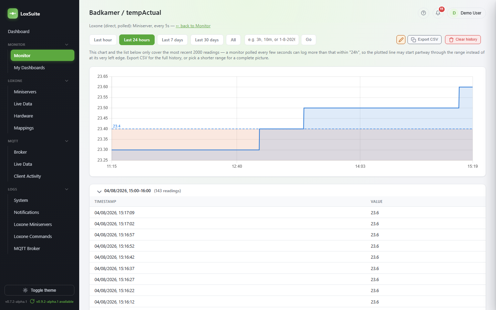
</picture>

</td>
</tr>
<tr>
<td width="50%">

**Miniservers** — status, firmware, and Gateway/Client relationships at a glance.

<picture>
  <source media="(prefers-color-scheme: dark)" srcset="docs/screenshots/miniservers-dark.png">
  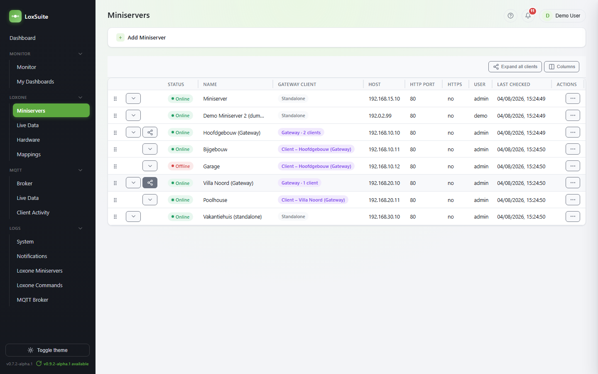
</picture>

</td>
<td width="50%">

**Mappings** — MQTT topics bridged to Loxone Virtual Inputs, and back.

<picture>
  <source media="(prefers-color-scheme: dark)" srcset="docs/screenshots/mappings-dark.png">
  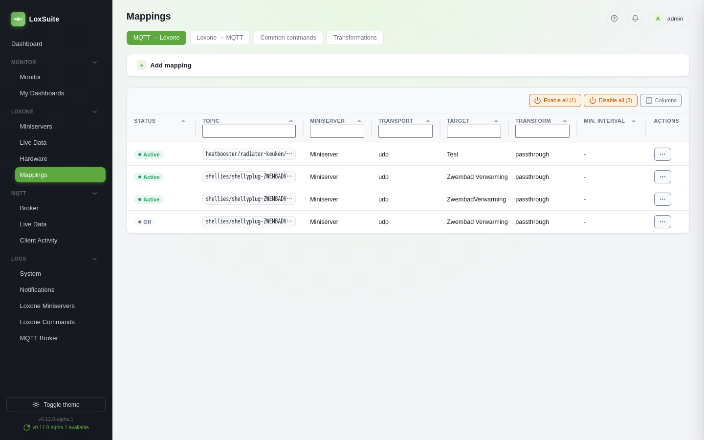
</picture>

</td>
</tr>
</table>

*(Demo data — light/dark follows your system theme on GitHub.)*

## Quick start

Everything runs as a single Docker container named `loxsuite` — Mosquitto and the gateway are
still two independent processes internally (see `gateway/docker-entrypoint.sh`), but nothing
else shows up in `docker ps`/Docker Desktop. Mosquitto user management runs through the
**dynamic-security** plugin instead of a classic password file, so accounts can be added from
the web UI without restarting the broker. The entire first-boot process is automated — no
`mosquitto_ctrl` needed:

1. Copy `.env.example` to `.env` and fill in your own values — at minimum, set a real
   `MQTT_ADMIN_PASSWORD` (the broker's break-glass account):
   ```
   cp .env.example .env
   ```
2. Start the stack:
   ```
   docker compose up --build -d
   ```
   On an empty `mosquitto/config` directory, this happens automatically, in order:
   - the container's entrypoint script creates `dynamic-security.json` with the
     `MQTT_ADMIN_USERNAME`/`MQTT_ADMIN_PASSWORD` account, then starts Mosquitto with
     dynamic-security enabled;
   - the gateway (started alongside it in the same container) connects once as that admin
     account and creates the `client` role (full read/write on every topic) plus the
     `MQTT_USERNAME`/`MQTT_PASSWORD` account it uses itself;
   - the gateway's own MQTT connection (which had been retrying) then succeeds, usually within a
     few seconds.

   These steps are idempotent — restarting with an existing `dynamic-security.json` does nothing again.
3. Open the web UI at `http://<host>:5582` and log in with `ADMIN_USERNAME`/`ADMIN_PASSWORD` from
   `.env`. This web UI admin account (separate from any MQTT account) is created automatically on
   first boot.

Add new devices (e.g. a Shelly) afterwards from the **Users** page in the web UI — no CLI commands
or restarts needed.

### Unraid

An Unraid Community Applications template is at [`unraid/loxsuite.xml`](unraid/loxsuite.xml) —
same single container, same env vars as above. It pulls a pre-built image from
`ghcr.io/daverutten/loxsuite`, published by [`.github/workflows/docker-publish.yml`](.github/workflows/docker-publish.yml)
on every push to `main` and on version tags — that workflow needs to have run at least once
before the template can pull anything.

To install it before it's listed in Community Applications: Unraid's **Docker** tab &rarr;
**Add Container** &rarr; **Template repositories** &rarr; add this file's raw GitHub URL (or copy
it directly into `/boot/config/plugins/dockerMan/templates-user/` on the Unraid box). Fill in the
same passwords/secrets the `.env` steps above ask for, and set the three path mappings to real
appdata locations — the config one especially, since MQTT Users/Roles management and MQTT-config
backups need it to actually persist.

## Features

### Dashboard

Broker connection status, active mapping counts, a **shared** panel board (the same 6 panel types
as My Dashboards below — chart/table/current value/gauge/stat with change/threshold — see that
section for details; this one is visible to everyone who logs in and editable by whoever has the
`dashboard` Access Role permission's edit checkbox, rather than by ownership), load statistics
(messages/sec, total messages, unique topics seen, connected client count), and a live status table
of every configured Miniserver.

The "Widget" button on Live Traffic pins a topic here as a current-value panel in one click,
auto-creating a monitor for that topic if one doesn't exist yet. Leave a panel's title blank and one
is generated from the topic (e.g. `shellies/shellyplug-ZWEMBADVerwarming/relay/0/power` becomes
"Zwembad Verwarming - Power") — this is a heuristic (splitting on case changes, stripping
brand/channel noise), so it won't always be perfect, especially for topics that are just an opaque
device ID with no descriptive words in them at all — rename the panel by hand in that case.

### Notification Center

A bell icon next to Help in the topbar, visible to every logged-in user, polling for new events
every 60 seconds. Opening it just shows the most recent events — the unread badge only clears via
**Mark all read**, **View all**, or once there's genuinely nothing left unread, not from merely
glancing at the list. **View all** links to a full history under **Logs → Notifications** (its own
permission area, separate from the other Logs tabs). Every event logged here also went through the
existing
[Apprise](https://github.com/caronc/apprise) rule engine for delivery — Monitor threshold,
Miniserver/MQTT client status, backup failure, Miniserver firmware changed, LoxSuite update
available, and (see Hardware above) Loxone device battery weak/firmware changed/online-offline are
all real, admin-creatable rule types, sendable to any channel exactly like the others — the three
hardware ones also carry their own configurable severity — except one:

- **Threshold ladder** — any threshold row on a Monitor or Dashboard chart can be flagged
  **Notify** (alongside its existing color); crossing into a flagged rung logs an event here
  directly, no rule or channel to set up at all — the only event source that's genuinely in-app
  only, everything else above can also reach Teams/Slack/Telegram/email/etc.
- **LoxSuite update available** — the sidebar's own version badge (a plain daily GitHub tags
  check, see `versionCheck.js`) already shows this passively; creating a rule for this trigger type
  additionally logs it here and can notify a channel, the same way a Miniserver's own firmware
  change can.

Each trigger type's own **message template** (title and body) is customizable from its admin page —
type `{{` in either field for an autocomplete menu of that trigger's own available placeholders, see
a live preview rendered against sample data as you type, and send a real test message to any
configured channel before saving.

Each item has its own **&times;** to dismiss just that one — personal to you, not a delete; the
underlying event still shows in Logs → Notifications and in every other user's own popover.
**Mark all read** at the bottom dismisses everything currently listed in one go and resets the
unread badge, same as opening the popover already does on its own.

<picture>
  <source media="(prefers-color-scheme: dark)" srcset="docs/screenshots/notification-center-dark.png">
  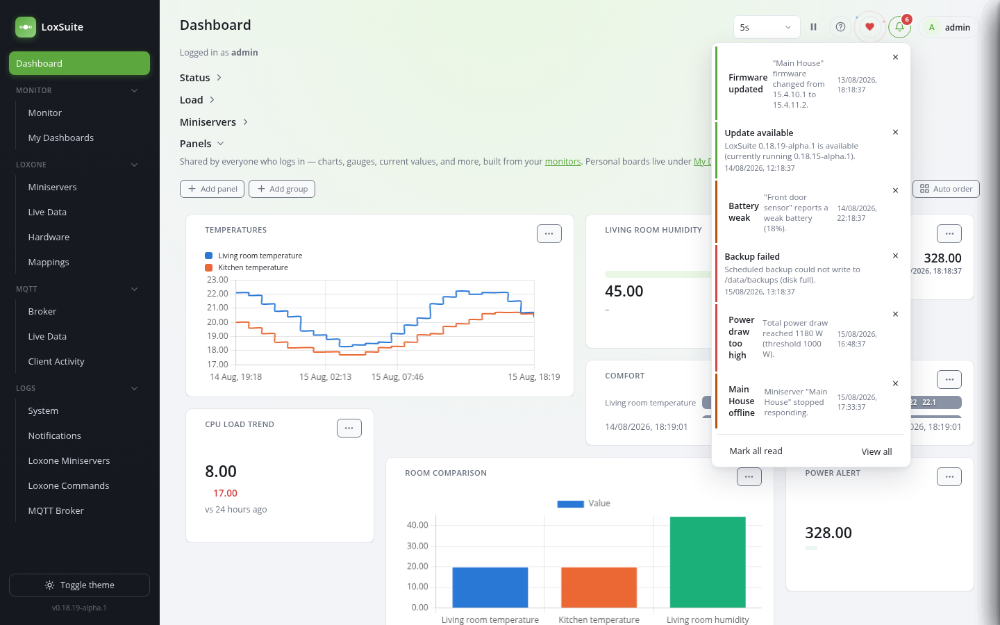
</picture>

*(Demo data.)*

### Monitor

Track a value over time and view it as a chart and/or a raw table, with a CSV export. Two sources:

- **MQTT topic** — records every message on a topic you pick (or add one straight from the "Monitor"
  button on Live Traffic).
- **Loxone (direct)** — pick a Miniserver, then a control/state from its structure export
  (`LoxAPP3.json`). Values come from one persistent, shared websocket connection per Miniserver
  (`getLiveValue` in `loxoneWebSocket.js`, also used by Live Data) that receives Loxone's own
  pushed state updates in real time — the interval you choose (5s&ndash;5min) controls how often a
  *history row* gets written from that live cache, not how fresh the value itself is. A plain HTTP
  request (`/jdev/sps/io/<uuid>`) is used only as a fallback, for the small slice of states that
  endpoint actually answers for (most sub-states are websocket-only), and only until the live
  connection has pushed a first value.
- **Miniserver diagnostic** — CPU load, heap, or task count from a Miniserver's own diagnostics
  (see Miniservers below). Fed from that page's existing background check, not polled a second
  time — a reading only lands here on the same interval the Miniservers page already refreshes on.

Readings are stored in SQLite and survive a gateway restart. Old readings are purged automatically
after a configurable retention period (default 30 days, editable on the Monitor page). A monitor's
detail page shows a line chart (Chart.js, bundled locally — no CDN) for monitors with at least one
numeric reading, plus the full raw-values table, both filterable by time range (1h/24h/7d/30d/all or
a custom range — type an absolute date like `1-8-2026` or `1-8-2026/-now`, Grafana-style) and
exportable as a plain `timestamp,value` CSV file. The chart itself gets the same configurability as
a Dashboard chart panel — appearance, thresholds (with the optional per-rung **Notify**, see
Notification Center above), Y-axis, annotations — via an edit drawer with a live preview, resizable
by dragging its edge; **star**/**reset** save that style as the default for every Monitor's chart at
once, so they can all share one look in a couple of clicks. The monitor list's own **Notification**
column flags which monitors currently have a Notify-flagged rung, without opening each one's chart
settings to check.

### My Dashboards

Personal (per logged-in user), saved, reusable dashboards built out of the monitors tracked on the
Monitor page — the same panel system the shared home Dashboard above uses, just scoped to your own
account instead of shared, and always editable by you regardless of Access Role (ownership is enough).
Create any number of named dashboards, each holding **panels**:

- **Chart** — a line chart by default; pick more than one monitor to overlay them for comparison. Per
  panel: legend position, Y-axis unit, straight or stepped line, optional point markers,
  fill-under-line, linear or logarithmic Y-axis with an optional fixed min/max,
  scroll-to-zoom/drag-to-pan, threshold lines *or* filled bands, and time-anchored annotations. Per
  series: rename, its own unit/scale/decimals, the right-hand axis, a fixed color, a line style
  (solid/thick/dashed/dotted), and any combination of **min/max/avg/current** shown right in the
  legend. **Chart type** can also be switched to **Bar (compare)**,
  **Doughnut**, **Pie**, **Polar Area**, or **Radar** — these five are snapshots (each monitor's
  *current* value, side by side) rather than a time series, for comparing several monitors at a
  glance instead of tracking one over time.
- **Table** — one monitor's raw values (single-monitor by design — a true multi-series comparison
  table would need aligning independently-sampled timestamps, which a chart panel already covers).
- **Current value** — a compact tile listing the latest reading for one or more monitors, stacked or
  in a row, each with its own optional rename/unit/scale/decimals override.
- **Gauge** — a fill-bar meter against a configurable min/max range, with an optional unit.
- **Stat with change** — current value plus the change vs. the start of the panel's time range, with
  an up/down arrow; optionally colored once you specify whether higher or lower is "better".
- **Threshold indicator** — a colored badge (with customizable normal/alert labels) that flips once
  the value crosses a configured limit.

<picture>
  <source media="(prefers-color-scheme: dark)" srcset="docs/screenshots/dashboard-chart-types-dark.png">
  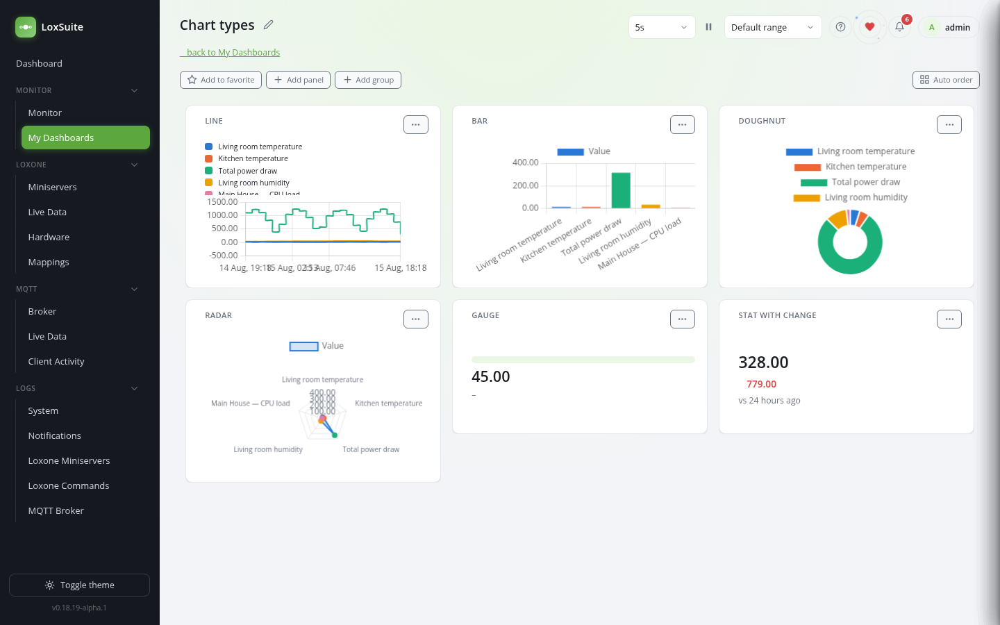
</picture>

*(Demo data — a line chart plus three of the five snapshot chart types (bar compare, doughnut,
radar), all comparing the same five monitors, alongside a gauge and a stat-with-change tile to show
the non-chart panel types too.)*

Every panel type's Edit form is grouped into the same labeled sections (Appearance, Axis, Range,
Condition, ...) regardless of type, so a given kind of setting always lives under the same heading.
Chart and current-value panels can hold several monitors at once; gauge/stat/threshold panels are
single-monitor, since each is inherently one number. Panels are drag-reorderable (top-left handle) and
drag-resizable (bottom-right corner), snapped to a 12-column grid so a size means the same thing
regardless of window width — or click **Auto order** to resize every panel to fit its own content and
repack them with the fewest gaps in one pass. Chart panels refresh via their own polling loop; every
other panel type rides the same 5-second auto-refresh the home Dashboard uses. Deleting a monitor
removes it from any panel referencing it automatically.

Panels can also be bundled into **groups** — a named, collapsible header that holds a set of panels
in their own zone. Drag a panel straight onto a group's header bar to move it in, drag it back out to
the top level, and drag a group's own header bar to reorder groups relative to each other (they
always sort amongst themselves, never mixed in with ungrouped panels).

Any panel's Edit form has a star and a reset icon: **star** saves that panel's whole appearance
(colors, legend, thresholds, line styles, ...) as the default for every panel of that type *on this
specific dashboard* — not global, so a chart's house style on one dashboard doesn't affect another.
**Reset** applies whatever's currently saved back onto that panel. Line/series colors are remapped
by position rather than by monitor id, so "line 1 is always red" holds even when you reset a panel
wired to entirely different monitors than whichever panel the default was saved from.

A dashboard can be **shared** with specific other users (viewer or editor access) or with an entire
Access Role, from the list's own **Share** button — the owner keeps full control regardless of what a
shared editor changes. The star button on any dashboard (in the list, or at the top of the dashboard
itself) pins it into the sidebar under **Monitor → Favorite Dashboards**, its own collapsible section,
for quick access to the boards you actually check often.

### Miniservers

Add one entry per physical Miniserver: name, host, HTTP port (with an HTTPS toggle for
self-signed-certificate Miniservers — certificate errors are ignored for this connection only),
optional UDP port, and a webservice username/password. The gateway checks every Miniserver in the
background on an interval you set (Settings, default 60s) and shows an Online/Offline/Unknown
badge plus its firmware version; **Test now** runs that check immediately, plus a **Loxone API**
line specifically confirming the response actually looks like a Loxone Miniserver's own API
(distinct from the plain Local/External reachability checks, which only prove *something*
answered HTTP there). A **Generation** column (Miniserver Gen 1/Gen 2, Miniserver Go Gen 1/Gen 2, or
Compact) reads `msInfo.miniserverType` from the structure file once per Miniserver — confirmed
against Loxone's own Structure File documentation — and never needs fetching again, since a
physical device's generation doesn't change. Editing a Miniserver never displays its stored
password — leave the field blank to keep it, or type a new one to change it.

Sparse or rarely-needed columns (Generation, UDP port, External URL) start hidden and can be
switched back on from the same **Columns** button every table has (see Other UI features below).
Drag any standalone or Gateway row to reorder Miniservers (a Client stays fixed under its own
Gateway) — this order isn't just cosmetic here: it's the one shared, authoritative order every
other page that lists Miniservers (Logs, Mappings, Monitor, Notifications, Hardware, Live Data,
...) now queries by too, instead of each picking its own.

Open a row's actions menu and pick **Diagnostics** to see PLC run state (Loxone's own documented 0–8
values, e.g. "Running"), CPU load, heap usage, task count, firmware date, and update channel — all
read via a handful of Miniserver HTTP commands that aren't in Loxone's official API reference but
were individually verified to work on real firmware. **Check for update** reads the current
release channel (Loxone doesn't expose a plain yes/no "update available" flag over HTTP, so this
can't tell you for certain whether you're already current) and unlocks **Update to latest
release**, which sends a real update command — an actual firmware update and reboot on that
Miniserver, with a confirmation dialog spelling out the consequences. **Add to Dashboard** / **Add
to Monitor** pin CPU load, heap, and task count as history-tracking monitors in one click — the
former also adds each as a widget on the shared home Dashboard, the latter only starts recording
history without pinning anything. All four actions are disabled (visible, not clickable) while a
Miniserver is offline.

<picture>
  <source media="(prefers-color-scheme: dark)" srcset="docs/screenshots/miniservers-diag-dark.png">
  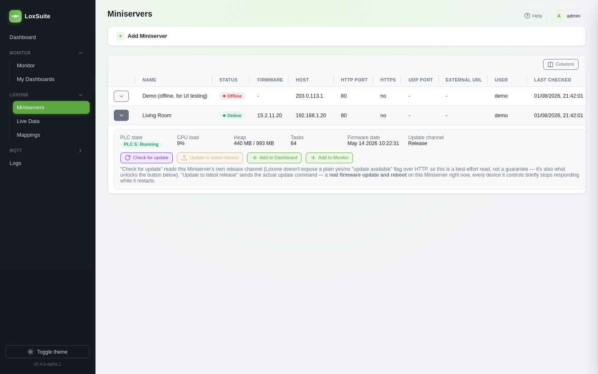
</picture>

*(Demo data.)*

An optional **External URL** (a full base address — DynDNS hostname with port, or a Loxone
DNS/Cloud address) can also be set. Every HTTP call this gateway makes to that Miniserver — Virtual
Inputs, Monitor polling, structure lookups, Common commands, Logs, and Test now — tries the local
Host/IP first and only falls back to the external URL if the local one fails at the network level
(timeout, refused, DNS), so one Miniserver entry stays usable both on the local network and
remotely without switching configuration.

There is no Loxone-sourced autocomplete for Virtual Input names: they are pure programming blocks
in Loxone Config and don't appear anywhere in a Miniserver's structure export (`LoxAPP3.json`) —
confirmed against a real Miniserver with 365 controls and zero Virtual Inputs in the export. Type
the name exactly as configured in Loxone Config — the field on the MQTT &rarr; Loxone mapping form
does suggest names you've already used in other mappings, which covers the common case of one
Virtual Input receiving several different mapped commands, but there's nothing to suggest for a
name you haven't typed anywhere yet.

### Live Data

Every control a Miniserver's structure export knows about, grouped by room and then by category —
the same grouping Loxone Config itself uses. Rooms, categories, and values are all only fetched
once actually expanded (a structure file can list hundreds of controls, so reading all of them up
front just to open the page would mean hundreds of requests before you've looked at any of them);
open values refresh automatically every few seconds. A **Suggest dashboard** button per room turns
its controls into a starter personal dashboard (lighting, climate, shading, energy) in one step —
toggle it off in Settings if you'd rather always add monitors/panels one at a time. The preview lets
you fine-tune before creating anything: uncheck any auto-picked item, **+ Add** another state of a
control already in a bucket (e.g. a climate control's target alongside its actual temperature), and
override which panel type or which bucket any individual item ends up in.

Check any number of individual control states across the page and the toolbar shows a running
count with **Monitor selected** and **Widget selected**, to act on a whole selection at once instead
of one row at a time. A state you never want cluttering the table (e.g. one that never meaningfully
changes) can be hidden from Settings.

<picture>
  <source media="(prefers-color-scheme: dark)" srcset="docs/screenshots/live-data-dark.png">
  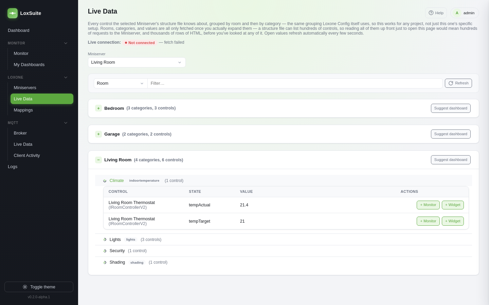
</picture>

### Hardware

Every piece of hardware a Miniserver's own `/data/status` endpoint reports — the Miniserver
itself, Extensions, Audioserver zones, and the Air/Tree/1-Wire/Plugin devices attached to it — all
in one flat, filterable, sortable table (category dropdown, free-text search, and every column's
usual click-to-sort/drag-to-reorder/resize/hide). Polled every 5 minutes in the background, so this
can lag Loxone Config by a few minutes; entirely skipped for a Miniserver that's currently offline
(or rebooting), so a reboot never floods the table — or an alert rule — with every attached device
briefly looking "offline" at once. A **battery** reading of 127 means mains-powered (AC/DC adapter),
not a real percentage, and is shown as **External power** instead; weak-battery flags
(`BattWeak`/`BatTooWeakForUpdate`) come straight from the Miniserver's own judgment, not a threshold
this app invented.

One rule already covers every device of a given kind automatically — current and any added
later — there's no per-device setup. The 3 buttons next to the search bar create (first click) or
toggle (every click after) a default "Any Miniserver" alert rule for a weak battery, a device
firmware change, or a device going offline, each with its own configurable severity (fine-tune
scoping, severity, or channels on Notifications). Every transition is also written to the Logs
&rarr; Loxone Miniservers log unconditionally, whether or not an alert rule exists for it — logging
and alerting are independent.

<picture>
  <source media="(prefers-color-scheme: dark)" srcset="docs/screenshots/hardware-dark.png">
  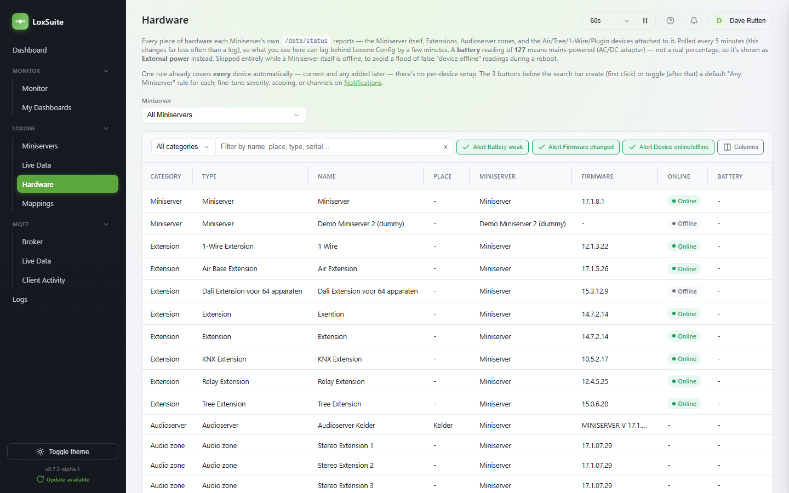
</picture>

*(Real data from a live installation.)*

### MQTT &rarr; Loxone

Subscribe to a topic (wildcards `+`/`#` supported) and forward each message to a Virtual Input on
a chosen Miniserver, via HTTP (`/dev/sps/io/<target>/<value>`) or UDP. Available value transforms:

- **Pass through unchanged**
- **on/off &rarr; 1/0**
- **JSON path** — pull one field out of a JSON payload
- **Translation table** — a free-form lookup you manage per mapping (e.g. `False &rarr; 0`, `open &rarr; 1`)

An optional **minimum interval (ms)** throttles a mapping so a fast-changing sensor can't flood the
Miniserver — messages arriving sooner than the interval since the last forwarded one are dropped.

### Loxone &rarr; MQTT

Each mapping gets a random token and publishes to one MQTT topic.

- **HTTP** — the mapping's row shows a ready-to-use callback URL
  (`http://<gateway-host>:5582/api/loxone-in/<token>?value=\v`) for a Virtual Output's HTTP command
  in Loxone Config; `\v` is replaced with the actual value on every call. This endpoint
  intentionally has no login (the Miniserver can't hold a session) — the unpredictable token is
  the security boundary.
- **UDP** — send `<token>=\v` as a Virtual UDP Output to the gateway on the port shown (11884 by
  default, configurable via `LOXONE_UDP_PORT`).

A **translation table** transform is available here too, e.g. for turning Loxone's `1`/`0` into
the `on`/`off` text a device expects.

Every mapping also has a **Test** action: publish a value straight to its topic without touching
Loxone at all, running through the same transform a real call would use — useful for confirming a
device reacts before wiring up the actual Virtual Output.

### Common commands & Common data

An interactive builder for devices with well-known MQTT topic shapes — 16 named Shelly Gen1 device
types (Plug, Plug S, Dimmer, Bulb, Bulb Duo, RGBW2, EM, 3EM, Uni, ...) plus Shelly Gen2/Gen3 (both
the full JSON-RPC form and the simpler `command/switch:N`/`command/cover:N` form some devices also
support). **Common commands** covers relay/roller/light/color/white commands; **Common data** covers
the matching telemetry (power, energy, temperature, position, ...). Pick a device — from every device
the broker has actually seen traffic for — and its type fills in automatically; correct it manually
if it guessed wrong or the device hasn't been seen yet. Each device entry is individually editable
(rename it, add/remove its own commands or data points), and the whole catalog can be exported to —
or re-imported from — JSON or XML, or reset back to the built-in defaults at any time. On **Live
traffic** → *Connected Clients*, devices that look like a Shelly link here with the device
pre-selected; a data point's "Use as Monitor" link jumps straight to a pre-filled Monitor form.

A separate, file-based way to add or override a device: drop a `.json` or `.xml` file into
`device-templates/` (same shape this page's own export/import already uses — see that folder's own
`README.md`), read once at gateway startup. Meant for a device definition you'd rather hand-write,
keep in version control, or share, without going through the UI at all; a file naming an existing
key (built-in or another file's) replaces that device, and an invalid file is skipped with a
message in the gateway's log naming the file and the problem, rather than failing the whole catalog.
`device-templates/heatmeister.json` and `heatmeister-ha.json` (see below) are real, working examples
of the format, not placeholders.

A Loxone &rarr; MQTT mapping also has a **Shelly RGBW/White/Tunable-white** value transform, which
converts Loxone's own RGB ("H,S,V") or Lumitech tunable-white ("brightness,kelvin") output format
into the JSON payload a Shelly RGBW2/Bulb/Duo actually expects — built in, no separate UDP
transformer plugin needed.

Also covers [SDR Innovation's HeatMeister](https://www.sdr-engineering.nl) (radiator/fan-coil
controller) — confirmed against its own protocol spec (firmware v2.8.2) and a real installation, all
under `heatbooster/<module name>/...`: fan boost/control mode, fan speed, ambient temperature
control, and the external sensor-override topics as commands; control state, fan speed, all four
temperatures, WiFi/firmware/runtime as data. A separate **SDR HeatMeister (Home Assistant
discovery)** family publishes Home Assistant MQTT Discovery configs for the same topics — this is
LoxSuite's own addition, not part of HeatMeister's own spec, since Home Assistant has no native
integration with it; tick **Retain** on whichever Loxone → MQTT mapping sends these; or Home
Assistant forgets the entity on its own next restart.

### Transformations

Every mapping (either direction) using the "Translation table" transform, in one place, with a
per-mapping entry count and a shortcut to manage it.

### Live traffic

Two views, both refreshing automatically (without a full page reload) every 5 seconds and both
in-memory only (cleared on a gateway restart):

- **Live Messages** — one row per topic seen (a running total shown at the top), with its actual
  and previous value, a message count (abbreviated past 1000 — `1.2K`, `3.4M` — for a broker that's
  been running for months, full number on hover), and a ready-to-copy **Command Recognition**
  string (`MQTT:\i<topic>=\i\v`) for a Loxone Virtual UDP Input. **Map** jumps to a pre-filled MQTT
  &rarr; Loxone mapping, **Widget** pins the value on the Dashboard.
- **Connected Clients** — which MQTT clients are connected or have been, split into a **Devices**
  tab and a **LoxSuite itself** tab (the gateway's own persistent connection, its one-shot
  dynamic-security bootstrap, and any ad-hoc Test button use — each with a stable `loxsuite-...`
  client ID, so real IoT traffic isn't buried among them). The **Device** column shows the topic
  prefix seen in that device's own MQTT traffic when one is known (hover to see the raw MQTT
  client ID), falling back to the raw client ID otherwise — there's no protocol-level way to ask
  the broker "who published this topic", so this is a best-effort match, not a guarantee. Devices
  that look like a Shelly get a "Suggest commands" shortcut. **Clear list** removes disconnected
  entries only — clients that are still actually connected stay listed, since they won't send a
  new "connected" event just because the view was cleared.

### Logs

Different from Monitor: real **log files** and structured events, not tracked values. Five tabs,
each with its own view/edit permission area, all live (refreshing every 5 seconds where it applies)
and persisted in SQLite (kept for a configurable retention, purged automatically — same model as
Monitor's history):

- **MQTT broker** — the raw Mosquitto broker log file, tailed the same way Connected Clients already
  reads it for connect/disconnect events, except every line is stored here.
- **Loxone Miniservers** — each configured Miniserver's own system log (`GET
  /dev/fsget/log/def.log`, Basic Auth), falling back to its External URL if the local address
  can't be reached. There's no push channel
  for this on the Loxone side, so the gateway polls once a minute and stores only newly appended
  lines; the first poll for a Miniserver backfills the last 500 lines instead of its full history. A
  Miniserver filter dropdown appears once more than one is configured.
- **Loxone commands** — every Virtual Output command Loxone sends this gateway (UDP or HTTP),
  accepted or rejected, with who sent it, when, which MQTT topic it targeted, and the value
  transition. A rejected row caused by a missing mapping gets a one-click **+ Mapping** button
  (pre-fills the Loxone → MQTT add form with that exact topic); an accepted row gets **+ Reject**
  to disable its mapping on the spot if it's misbehaving.
- **System** — everything else worth an audit trail: settings changes, account/role changes,
  scheduled-job results, and any single database query that took 200ms or longer (a symptom worth
  seeing on its own, e.g. slow storage on some self-hosting setups, without needing to reproduce it
  live).
- **Notifications** — every event the Notification Center has ever recorded, filterable the same way
  as the other tabs; see Notification Center above. Its **Source** column links straight to
  whatever the event was actually about, where there's a single entity to land on — a Monitor's own
  detail page for a threshold breach/notify rung, or the Miniservers page with that row's
  diagnostics panel already open for a status/firmware change.

Each line gets a best-effort **Level** badge (info/warning/error), guessed from its own wording
since most sources don't tag lines with a real severity — a scanning aid, not a guarantee.

Every tab has a filter bar: **From**/**To** (date/time range), **Level**, and **Contains** (plain
substring search). Filters combine, live in the URL, and survive the 5-second live refresh; the
table still caps out at 1000 rows even when filtered. **Export .log** on any tab downloads
everything currently retained as plain text, unfiltered.

### Users (MQTT accounts)

Add a username/password/role for a new device — no broker restart needed, changes take effect
immediately. Backed by Mosquitto's dynamic-security plugin rather than a password file, precisely
so this can be managed live from the UI. Change a device's role right in the table, or reset its
password without recreating the account. The gateway's own account (`gateway` by default) can't be
edited or deleted here, since that would lock the gateway itself out of the broker.

With **Per-device MQTT roles** turned on (Settings &rarr; MQTT Broker, off by default), the Add form
gains an optional **Device topic prefix** field — filling it in (e.g. `shellies/shellydimmer-Toilet`)
creates (or reuses) a role scoped to just `<prefix>/#` and assigns that instead of the shared
`client` role, so a compromised device credential can't read or write topics belonging to any other
device. Leaving it blank falls back to the Role dropdown, same as when the setting is off.

### Roles

A role is a named set of ACL rules (publish/subscribe permissions on topic patterns); a user is
assigned one or more roles. Out of the box, `client` has full publish/subscribe on every topic
(`#`) and `admin` is Mosquitto's own built-in role. Both are protected from *deletion* (the
gateway's bootstrap and every device account depend on them) but their ACL rules can still be
edited like any other role. An existing ACL's type/topic/allow can be changed in place (**Edit**)
instead of removing and re-adding it — Mosquitto's dynamic-security plugin has no native "modify"
command, so this does an add-then-remove behind the scenes when the topic or type actually
changes, ordered so a failed add never leaves a role with neither the old nor the new grant.

### Settings

- **Broker connection** — host/port/username/password/TLS the gateway itself uses to connect to
  MQTT. Defaults to the bundled Mosquitto process running in the same container, but can point at
  any external broker; saving reconnects immediately. The `MQTT_URL`/`MQTT_USERNAME`/`MQTT_PASSWORD`
  environment variables only seed this setting on the very first start.
- The bundled broker also listens for **MQTT over WebSocket** on port `9001` (`ws://<gateway-host>:9001`),
  alongside plain MQTT on `1883` — same accounts, roles, and ACLs either way, for browser-based MQTT
  clients/dashboards that can't open a raw TCP socket. Only written into a genuinely fresh
  `mosquitto.conf` (an empty `Mosquitto Config` volume) the same way the rest of that file is —
  add `listener 9001` / `protocol websockets` to an existing one yourself to pick it up on upgrade.
- **Auto-create Loxone &rarr; MQTT mappings** — off by default. When enabled, a call to
  `/api/loxone-in/<anything>` that doesn't match an existing token is treated as a literal MQTT
  topic and a new passthrough mapping is created on the spot instead of returning 404. Convenient
  for wiring up Loxone quickly, but it means any string reaching that endpoint becomes a real
  topic — leave it off unless you specifically want that.
- **Per-device MQTT roles** — off by default; see Users (MQTT accounts) above. When enabled, adding
  a device account with a topic prefix filled in scopes its role to just that device's own topics
  instead of the shared `client` role.
- **Miniservers check interval** — how often every configured Miniserver is re-checked for
  reachability, firmware version, and diagnostics (default 60s, 10s minimum). Takes effect on the
  very next check, no gateway restart needed.

### Administration & Access Roles

Visible only to users whose Access Role has **Administrator** checked. Six tabs:

- **General** — re-run the guided first-run setup wizard any time: admin password, timezone,
  Miniserver, MQTT broker connection, SSO, backups, and notifications, each step skippable and
  each with a **Test** button where a live connection makes sense (Miniserver, MQTT, notification
  channel). Re-running doesn't undo anything already configured — every step is pre-filled with
  whatever's currently set, and a step's badge only gets a checkmark once you've actually gone
  through it (Skip or a real save).
- **Users** — every web UI account (distinct from **Users (MQTT accounts)** above, which is about
  IoT devices connecting to the broker). Add a local account, change anyone's Access Role, reset a
  local user's password, or delete an account. The gateway always keeps at least one administrator
  — deleting, demoting, or reassigning the last remaining admin is blocked with an error.
- **Access Roles** — named permission sets. Each role has a fixed matrix of one **view**/**edit**
  pair per page in the app (Monitor, Miniservers, MQTT Users, Settings, and so on), plus a separate
  matrix underneath for the four Logs tabs specifically (a role can be trusted with the System log
  without also seeing the MQTT broker log) — a **None** button clears every log checkbox in one
  click instead of unchecking each individually. An **Administrator** role bypasses the matrix
  entirely and always has full access — that flag is separate from the matrix so a role can never
  grant itself more power through it. A page a role has no rights to at all doesn't appear in its
  nav either, not just blocked on request; the server enforces every request regardless of what the
  UI shows.
- **Backups** — schedule (a standard 5-field cron expression) or manually trigger a zip of the
  gateway's own SQLite database and, optionally, Mosquitto's dynamic-security/broker config, with a
  **Keep last** retention count so it can run indefinitely without slowly filling the disk. An
  optional **offsite copy (rclone)** step additionally pushes every backup to any of rclone's 70+
  supported storage backends right after it's created — **S3-compatible** (AWS S3, MinIO, Wasabi,
  DigitalOcean Spaces, Cloudflare R2, ...), **SFTP**, **WebDAV** (Nextcloud, ownCloud, ...), and
  **Backblaze B2** each get a plain field-by-field form that builds the underlying `rclone.conf`
  for you (passwords obscured via rclone's own `rclone obscure`, never stored in plain text) —
  pasting a hand-written `rclone.conf` (any of rclone's 70+ backends, not just these four) is still
  there as the general-purpose option.
- **Notifications** — alert rules for a Monitor crossing a threshold, a Miniserver or MQTT client
  going online/offline, a backup failing, a Miniserver's firmware changing, or a newer LoxSuite
  release becoming available, sent through
  [Apprise](https://github.com/caronc/apprise) to Teams, Slack, Telegram, Email, or 100+ other
  services. **Channels** (a name plus one Apprise URL) and **Rules** (which event, and which
  channel(s) it fires to) are kept as two separate, reusable lists. A channel's **Service** picker
  offers **Email (SMTP)**, **Telegram**, **Slack**, **Microsoft Teams**, and **Discord** — paste
  the webhook URL/bot token/SMTP details the service itself gives you and the actual Apprise URL is
  built for you, with a live preview before saving; **Custom (Apprise URL)** still takes any raw
  Apprise URL directly, for the 100+ services without their own form here. Every user can *also* set
  up their own, entirely independent notifications — see Profile below.
- **Security** — the login page's rate limit (max attempts and time window), and **Single Sign-On**:
  connect a self-hosted [Pocket ID](https://pocket-id.org) instance so people can log in with it
  *alongside* (not instead of) the existing username/password login. The first sign-in via Pocket ID
  auto-creates an account with a configurable default Access Role. When creating the OIDC client in
  Pocket ID, set the **Callback URL** to `http://<gateway-host>:5582/auth/sso/callback` (shown on
  this page) and, if you want LoxSuite to appear as a launchable app on the Pocket ID home screen,
  set the **Client Launch URL** ("User URL") to `http://<gateway-host>:5582/`.

<table>
<tr>
<td width="50%">

<picture>
  <source media="(prefers-color-scheme: dark)" srcset="docs/screenshots/backup-dark.png">
  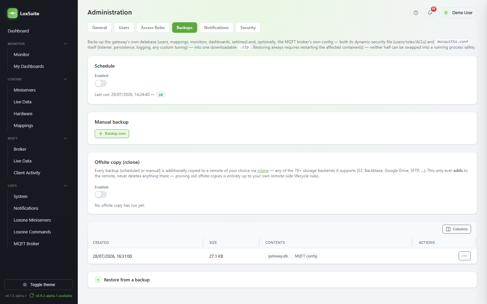
</picture>

</td>
<td width="50%">

<picture>
  <source media="(prefers-color-scheme: dark)" srcset="docs/screenshots/notifications-dark.png">
  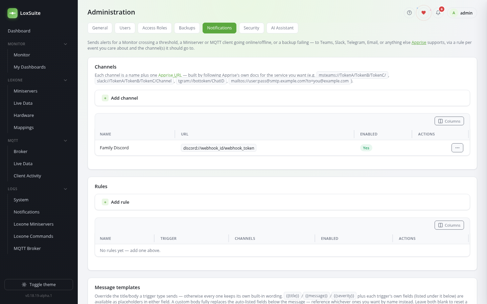
</picture>

</td>
</tr>
</table>

*(The Backups screenshot above shows the graphical S3-compatible rclone form; below is the
Notifications page's graphical Discord channel form, both filled in but not yet saved.)*

<picture>
  <source media="(prefers-color-scheme: dark)" srcset="docs/screenshots/notifications-add-channel-dark.png">
  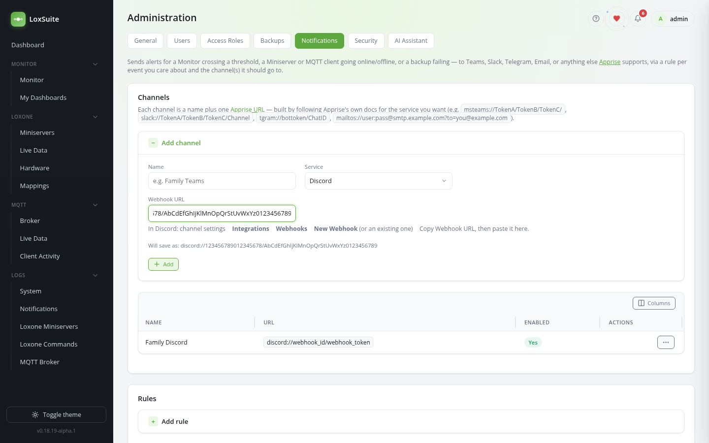
</picture>

<picture>
  <source media="(prefers-color-scheme: dark)" srcset="docs/screenshots/security-dark.png">
  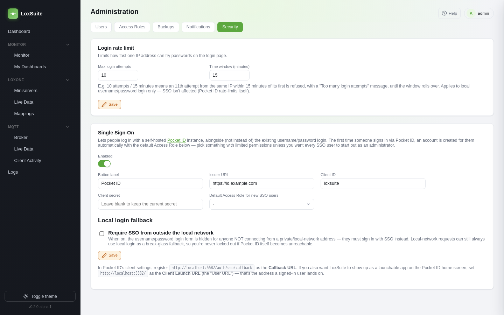
</picture>

### Profile

Every logged-in user's own account, in two tabs. **Account**: avatar, display name, email, Access
Role, and sign-in method. Pocket ID (SSO) accounts get their avatar/name/email from Pocket ID
automatically (refreshed on every login); local (username/password) accounts can set a display
name/email themselves and change their password here — SSO accounts have no local password to
change, that's managed by Pocket ID.

**Notifications** is personal, self-service alerting, independent of anything an administrator sets
up: your own [Apprise](https://github.com/caronc/apprise) channel URL (**My channel**), your own
trigger rules (**My rules** — the same trigger types the admin Notifications page offers, but
private to you and needing no admin involvement, always delivered to your own channel), and the
option to subscribe yourself to any of the admin-configured rules too (**Subscriptions**), on top of
whatever channel(s) they already send to.

### Other UI features

- **Per-user table customization** — drag a column header to reorder it, use the **Columns**
  button to show/hide columns (a handful of rarely-needed ones, e.g. Miniservers' Generation/UDP
  port/External URL, start hidden until you turn them on). Stored server-side per logged-in user,
  so it follows you across browsers/devices (not `localStorage`).
- **Remember me** on login keeps a session for 30 days. Sessions live in the same SQLite database
  as everything else, so a remembered login also survives a gateway restart — it isn't just a
  longer cookie on top of an in-memory session.
- **Light/dark theme** toggle in the sidebar, remembered per browser, applied before first paint
  (no flash of the wrong theme).
- An interactive **Help** page (in the sidebar) walks through everything above from inside the app.

## Security

- **CSRF protection** — a synchronizer token, stamped onto every form client-side and checked on
  every state-changing request. Session cookies use `SameSite=Lax` (not `Strict`, which would
  break the Pocket ID SSO redirect callback).
- **Login rate-limiting** — configurable from Administration &rarr; Security (default 10 attempts
  per 15 minutes per IP on `/login`).
- **Secrets encrypted at rest** — Miniserver passwords, the MQTT broker password, the SSO client
  secret, and any saved `rclone.conf` are stored encrypted (AES-256-GCM) in `gateway.db`, not
  plain text. The key is derived from `SESSION_SECRET` (see Environment variables below) — **that
  value has to stay the same across restarts**, or these secrets become unreadable (they aren't
  lost, just unrecoverable until you re-enter them). Set it once to a real random value and don't
  change it afterward. If it's ever missing at boot (e.g. a container edit that blanked the field
  out — a known Unraid gotcha, see the Unraid section above), the container log prints an
  unmissable warning rather than silently limping along on an insecure fallback whose only other
  symptoms are confusing, seemingly unrelated errors (MQTT "not authorised", a Miniserver HTTP 403).
  Recovering just means setting a stable value again and re-entering each affected password/secret
  once through the web UI — it doesn't have to be the original value.
- **Emergency password reset** — if you're ever locked out of the web UI, drop a file named
  `reset-password.txt` into the same directory as `gateway.db` (the `Data` volume/path), containing
  just the affected username. On the next boot, that account gets a fresh random password (printed
  once to the container's own log, then the file is deleted), and every existing session is signed
  out. Needs the same filesystem access restoring the database from a backup already does — this
  doesn't add a new way in, just a safer one than editing the SQLite file by hand.
- The web UI itself has no built-in TLS. If you expose it beyond a trusted LAN, put a
  TLS-terminating reverse proxy (Caddy, nginx, Traefik, ...) in front of it.

## Known scope limitations

- No autocomplete for a brand-new Virtual Input name — see the Miniservers section above (the
  mapping form does suggest names you've already used elsewhere).
- MQTT device accounts share one `client` role with access to every topic by default; per-device
  topic restriction is opt-in (**Per-device MQTT roles** in Settings, see Users (MQTT accounts)
  above), not automatic for accounts already created before turning it on.

## Data and persistence

- Mosquitto data/logs and its dynamic-security state live in Docker volumes / `./mosquitto/config`.
- All mappings, Miniserver configuration, users, and sessions live in one SQLite file at
  `./data/gateway.db` (bind-mounted, so it's easy to back up).
- Common Commands/Data device templates (built-in examples plus any of your own) live as plain
  `.json`/`.xml` files under `./device-templates` — see that folder's own `README.md`.

## Environment variables

| Variable | Purpose |
|---|---|
| `MQTT_USERNAME` / `MQTT_PASSWORD` | Account the gateway itself connects to the broker with. Created automatically on first boot. |
| `MQTT_ADMIN_USERNAME` / `MQTT_ADMIN_PASSWORD` | Break-glass dynamic-security admin account, used once on first boot to bootstrap the `client` role and the gateway's own account. Keep the password somewhere safe. |
| `SESSION_SECRET` | Random long string used to sign session cookies *and* to derive the key that encrypts Miniserver/MQTT/SSO/rclone secrets at rest — set it once, keep it the same afterward (see Security above). |
| `ADMIN_USERNAME` / `ADMIN_PASSWORD` | Web UI admin account, created on first boot if the `users` table is empty. |
| `DB_PATH` | SQLite database path (set in `docker-compose.yml`, rarely needs changing). |
| `LOXONE_UDP_PORT` | UDP port the gateway listens on for Loxone &rarr; MQTT UDP mappings (default 11884). |
| `DEVICE_TEMPLATES_PATH` | Directory the gateway reads Common Commands/Data device template files from at startup (set in `docker-compose.yml`, rarely needs changing). |

## Security notes

- Change `SESSION_SECRET`, `ADMIN_PASSWORD`, `MQTT_PASSWORD`, and `MQTT_ADMIN_PASSWORD` in `.env`
  before exposing this beyond your local network.
- `/api/loxone-in/:token` has no login by design (the Miniserver can't hold a session) — its
  security is the unpredictable per-mapping token, not authentication.
